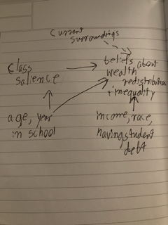

```{r}
library(knitr)
```


Chapter 6

1. Their reasoning is talking more about some exceptions to the rule, and are anecdotal examples, so their reasoning is flawed here- since the argument is that is makes you "more likely" to earn above $100k, it is not an absolute and there can be exceptions (it moves the distribution to the right to higher income values, but that doesn't mean that the tail end values of the distribution disappear).


2. 

a- CoinFlip and TerryInRoom have a direct effect on Money

b- Terry'sMood has an indirect effect on Money


3.

a- The direct effects of reading harry potter as a kid, reading other rowling books, and liking reading on the variable of interest "reading as an adult" 

b- An indirect effect that should be included is that of the age someone was when Harry Potter was released, as that will influence if they read harry potter as a kid or not, which then influences reading as an adult (according to the path diagram)

c- One alternative explanation that is also in the diagram is that people who like reading are likely to have read more books both in childhood and adulthood, so it is likely that if they read more books as a kid they may have read harry potter.


4. 

a- We would include variables that we can't observe in the diagram because they are still important in our analysis; even if we can't quantify them, it is important to note that they could be behind an alternative explanation, or could be influencing our other variables.

b- LikesReading is a latent variable because you can't directly observe it or calculate it like you can with age, race, number of books read as an adult, etc. You could have a respondent fill out a scale with their self-evaluation of how much they enjoy reading, but that is not something you can get without interaction and also may not be a wholly accurate measure of the concept, since now what you are measuring is someone's opinion of how much they like to read.


5.

a- 
```{r}
knitr::include_graphics("IMG_4651.png")
```

b- One ommitted arrow could be the season- forest fires are more likely to occur in the summer.


6.

a- One research question I have (this is the project we're doing in Mark's class! still workshopping it through) is how class salience influences opinions on inequality and wealth redistribution; a possible data generating process for this is a survey, where the treatment group is primed with a scale that causes them to have higher class salience, and afterwards they are asked questions about their beliefs regarding inequality and wealth redistribution (as well as basic demographic factors)

b- The cause is class salience, and the outcome variable is opinions on inequality and wealth redistribution

c- Other variables include demographic variables that may influence either of the two variables- age, income, year in school, race, having student debt, etc.

d- 
```{r}

```

e- Some unobserved variables (which I included in the diagram above) could be their surroundings while taking the survey- there have been studies showing that when people are in surroundings that remind them of inequality, based on their class they will respond to questions about inequality differently (higher income people will be less prone to wealth redistribution, and vice versa for lower income people)


7.

a- Six variables could be FreeShipping, NumberofTimesPurchased (since the question says 'cause people to buy items...more' as opposed to 'buy more items' I'm taking this to mean that the operationalization should be the number of times a person buys items from this online store), Income, PricesofItems, International (since international shipping is usually very expensive, people ordering from outside of the country where the good is produced may have a stronger reaction to the free shipping), and InternetAccess

b- It depends on how you are gathering the data; if you are getting it from each individual, then these 6 variables should be easy to gather. However, if you're doing aggregate measures or getting data directly from the website, then it would likely be difficult to get the Income and InternetAccess measurements. 


8. Causality means that one variable influences/changes another ("causes"). Causality is interesting and important because it is a way to not only better understand our world, but the problems we face- it is very difficult to solve problems without knowing their root causes.


9. D (you would be representing those variables and the relationships with the diagram)


Chapter 7


1. B, because B is the most related to viewership


2. 
```{r}
knitr::include_graphics("IMG_4653.png")
```


3. 

a- The treatment is funding of public schools, and the outcome is student achievement

b- Relevant variables (besides the two listed in part a) are region, median income of the school district, and political ideology of the school district

c- Region and median income of the school district

d- These are important because they could serve as alternative explanations (e.g. negating the relationship between the two variables once it is accounted for)

e-
```{r}
knitr::include_graphics("IMG_4654.png")
```

f- This diagram could be simplified by combining region and median income into one variable- zip code/school district attributes


4.

a- Unimportance- a situation where this could be used is if the effect a variable is causing is very small

b- Redundancy- a situation where two variables can be combined, because they both cause each other

c- Mediators- a situation where a variable is only serving as a mediator (no other possible influence), so we can remove them

d- Irrelevance- a situation where a variable isn't actually related to the research question (even though you might collect this data)


5. A causal diagram avoid cyclic relationships by adding a time factor, or by adding some source of random variation to stop the loop in the first place


6. 

a- The cause variable is developing long COVID, and the outcome variable is developing a disability identity

b- Variables: SES, access to healthcare, age, gender, pre-existing medical conditions, knowing people with a disability

c-

```{r}
knitr::include_graphics("IMG_4623.png")
```

d- I would say that knowing someone with a disability might not actually influence the outcome variable of developing a disability identity, because that would vary based on the person's disability as well as how often (if at all) they talk about their disability identity to the subject


7. I would change the diagram by adding a time element (since you can't really randomly assign someone to be more motivated or succeed more), so similar to the you punch me/I punch you example in the book, I would adjust the diagram so that there are two lines, with motivation(t) leading to student achievement(t+1) and the other line having student achievement(t) lead to motivation (t+1)


